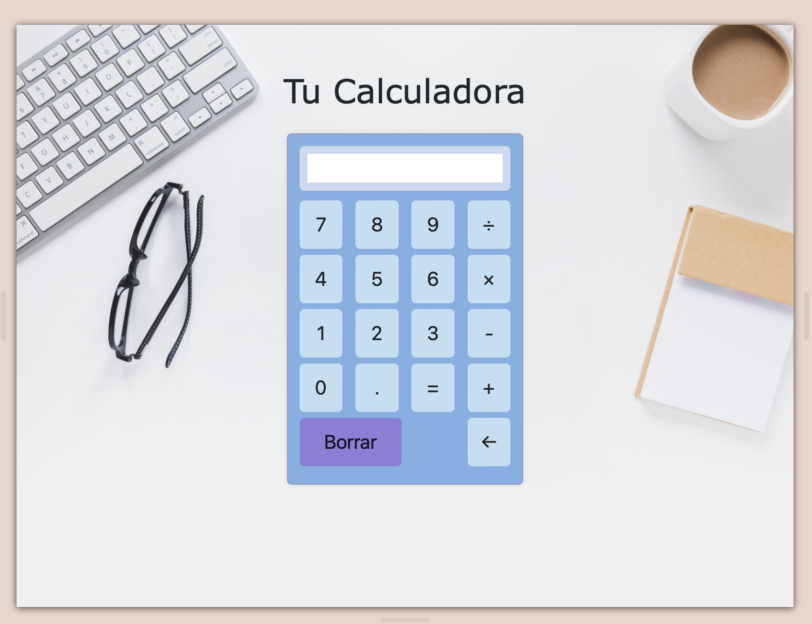

# PROYECTO TU CALCULADORA

Creación colaborativa de Calculadora Frontend para representar lo aprendido en el Módulo 2 "Fundamentos de Desarrollo Front-End" del BootCamp "Desarrollo de Aplicaciones Full Stack Java Trainee v2.0" impartido por FUDESCO en el marco de la iniciativa público - privada Talento Digital para Chile, impulsada por Fundación Chile y Fundación Kodea.

La Caculadora Frontend permite realizar operaciones matemáticas básicas - suma, resta, multiplicación, división - con números enteros y/o decimales. Dentro de sus funcionalidades, cuenta con un botón para resetear el display, y con un botón para borrar la última cifra de mismo.

## INSTRUCCIONES

Si tienes GitHub Desktop y/o GitHub puedes clonar el código a tu ordenador local desde la terminal, utilizando el comando git clone <https://github.com/JesuFertez/Calculadora.frontend.git> o hacer click en "Download Zip" para descargar la carpeta en tu ordenador local. Una vez descargada la carpeta, debes descomprimirla, y abrir con tu navegador el archivo "calculadora.html", desplegándose así la "Calculadora Frontend" para su utilización.

## CONSTRUIDO CON

- HTML
- CSS
- JavaScript
- Jquery
- Bootstrap

## PREVISUALIZACION

## AUTORES :busts_in_silhouette:

- Kevin Gonzalo Oyola Campos [@kevinoyola](https://github.com/kevinoyola)
- Marlene Elizabeth Castro Pino [@LelenElizabeth](https://github.com/LelenElizabeth)
- María Jesús Fernández Cortez [@JesuFertez](https://github.com/JesuFertez)
- Daniela Inostroza Ávila [@dinostrozaavila](https://github.com/dinostrozaavila)

## REPOSITORIO GITHUB :computer:

https://github.com/JesuFertez/Calculadora.frontend.git

## CONTRIBUCIÓN :sparkles:

Si quieres contribuir con la Calculadora Frontend realiza el "Pull Request"/"Petición de Validación". Muchas gracias!
